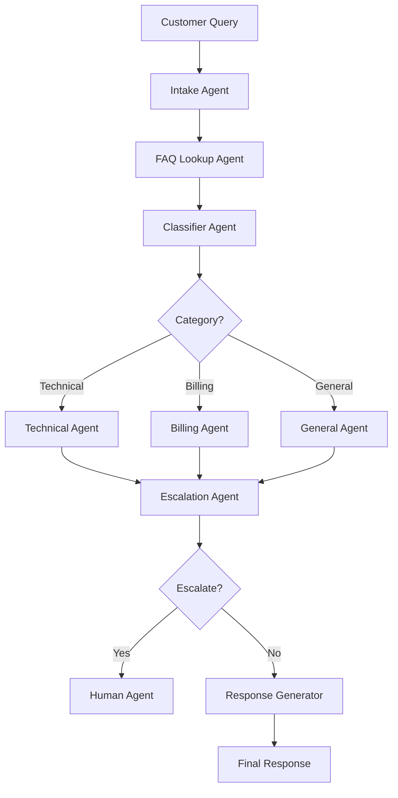

# Customer Support Ticket Management Multi-Agent System

A production-ready multi-agent AI system built with **LangGraph** and **LangChain** that automates customer support ticket processing, routing, and resolution.

## Overview

This system uses 6 specialized AI agents working together to:
- Automatically categorize customer support tickets
- Search knowledge base for quick resolutions
- Route tickets to specialized agents (Technical, Billing, General)
- Intelligently determine when human escalation is needed
- Generate professional, empathetic customer responses

### Key Benefits

- **24/7 Availability**: Round-the-clock automated support
- **Faster Response Times**: 2-5 seconds vs 30+ minutes with human agents
- **Cost Reduction**: ~60-75% reduction in human agent workload
- **Consistent Quality**: Professional, uniform responses
- **Intelligent Escalation**: Automatically escalates complex issues
- **Scalability**: Handle 100+ concurrent tickets

## System Architecture

### 6-Agent Workflow

```
Customer Query
     ↓
1. Ticket Intake Agent ────→ Extracts key information
     ↓
2. FAQ Lookup Agent ────────→ Searches knowledge base
     ↓
3. Category Classifier ─────→ Categorizes (Technical/Billing/General)
     ↓
     ├──→ Technical Support Agent
     ├──→ Billing Support Agent
     └──→ General Support Agent
     ↓
4. Escalation Evaluator ────→ Decides if human needed
     ↓
     ├──→ [Escalated] → Human Agent
     └──→ [Auto-resolve]
          ↓
5. Response Generator ──────→ Creates final response
     ↓
Customer Response + Ticket Log
```

## Project Structure

```
customer-support-ticket-mgmt-multi-agent-system/
├── src/
│   ├── agents/                 # Individual agent implementations
│   │   ├── intake_agent.py     # Receives and extracts info
│   │   ├── faq_agent.py        # Knowledge base search
│   │   ├── classifier_agent.py # Category classification
│   │   ├── technical_agent.py  # Technical support
│   │   ├── billing_agent.py    # Billing support
│   │   ├── general_agent.py    # General inquiries
│   │   ├── escalation_agent.py # Escalation evaluation
│   │   └── response_agent.py   # Response generation
│   ├── api/
│   │   └── main.py             # FastAPI REST API
│   ├── models/
│   │   └── state.py            # State definitions
│   ├── utils/
│   │   ├── logger.py           # Logging configuration
│   │   └── metrics.py          # Performance metrics
│   ├── config.py               # Configuration management
│   └── workflow.py             # LangGraph workflow orchestration
├── data/
│   └── faq_database.json       # Knowledge base
├── scripts/
│   ├── run_example.py          # Direct workflow example
│   ├── test_api.py             # API testing script
│   └── add_faq.py              # FAQ management utility
├── logs/                       # Application logs
├── tests/                      # Unit tests
├── .env.example                # Environment template
├── requirements.txt            # Python dependencies
├── setup.py                    # Package setup
├── Makefile                    # Convenience commands
└── README.md                   # This file
```

## Quick Start

### Prerequisites

- Python 3.8 or higher
- Groq API key
- Virtual environment (recommended)

### Installation

1. **Clone or navigate to the project directory**
   ```bash
   cd customer-support-ticket-mgmt-multi-agent-system
   ```

2. **Create and activate virtual environment**
   ```bash
   python -m venv .langgraphvnv
   source .langgraphvnv/bin/activate  # On Windows: .langgraphvnv\Scripts\activate
   ```

3. **Install dependencies**
   ```bash
   pip install -r requirements.txt
   ```

   Or using make:
   ```bash
   make install
   ```

4. **Configure environment**
   ```bash
   cp .env.example .env
   ```

   Edit `.env` and add your Groq API key:
   ```env
   GROQ_API_KEY=sk-your-api-key-here
   ```

5. **Verify installation**
   ```bash
   python -c "import langgraph; print('✅ Installation successful!')"
   ```

## Usage

### Option 1: Run as REST API (Recommended)

**Start the API server:**
```bash
python -m src.api.main
```

Or using make:
```bash
make run
```

The API will be available at `http://localhost:8000`

**API Documentation:**
- Swagger UI: http://localhost:8000/docs
- ReDoc: http://localhost:8000/redoc

**Example API Request:**
```bash
curl -X POST "http://localhost:8000/api/v1/tickets/process" \
  -H "Content-Type: application/json" \
  -d '{
    "customer_query": "My app crashes when uploading files",
    "customer_email": "customer@example.com"
  }'
```

**Test the API:**
```bash
python scripts/test_api.py
```

Or using make:
```bash
make test-api
```

### Option 2: Direct Workflow Execution

**Run example tickets:**
```bash
python scripts/run_example.py
```

Or using make:
```bash
make run-example
```

**Use in your code:**
```python
from src.workflow import app
from datetime import datetime
import uuid

# Create initial state
state = {
    "customer_query": "How do I reset my password?",
    "ticket_id": f"TKT-{uuid.uuid4().hex[:8].upper()}",
    "category": "",
    "faq_match": "",
    "resolution": "",
    "needs_escalation": False,
    "final_response": "",
    "conversation_history": [],
    "customer_email": "customer@example.com",
    "priority": "medium",
    "timestamp": datetime.now().isoformat(),
    "metadata": {}
}

# Process ticket
result = app.invoke(state)

# Access results
print(f"Category: {result['category']}")
print(f"Response: {result['final_response']}")
print(f"Escalated: {result['needs_escalation']}")
```

## API Endpoints

### Process Ticket
**POST** `/api/v1/tickets/process`

Process a customer support ticket through the multi-agent system.

**Request Body:**
```json
{
  "customer_query": "string",
  "customer_email": "string (optional)",
  "ticket_id": "string (optional)"
}
```

**Response:**
```json
{
  "ticket_id": "TKT-ABC123",
  "category": "TECHNICAL",
  "final_response": "Thank you for contacting support...",
  "needs_escalation": false,
  "priority": "medium",
  "timestamp": "2025-01-15T10:30:00",
  "conversation_history": [...]
}
```

### Get Metrics
**GET** `/api/v1/metrics`

Get system performance metrics.

**Response:**
```json
{
  "total_tickets": 150,
  "escalated_tickets": 30,
  "automation_rate": 80.0,
  "average_response_time": 3.5,
  "category_distribution": {
    "TECHNICAL": 60,
    "BILLING": 45,
    "GENERAL": 45
  }
}
```

### Health Check
**GET** `/health`

Check API health status.

## Configuration

All configuration is managed through environment variables in `.env`:

```env
# Groq Configuration
GROQ_API_KEY=your-api-key-here
GROQ_MODEL=llama-3.1-70b-versatile    # or mixtral-8x7b-32768
TEMPERATURE=0.7

# Application Settings
LOG_LEVEL=INFO
LOG_FILE=logs/ticket_system.log

# Escalation Settings
CONFIDENCE_THRESHOLD=0.7

# FAQ Configuration
FAQ_DATABASE_PATH=data/faq_database.json
FAQ_SIMILARITY_THRESHOLD=0.75

# API Configuration
API_HOST=0.0.0.0
API_PORT=8000

# Ticket Settings
TICKET_ID_PREFIX=TKT
MAX_CONVERSATION_HISTORY=50
```

## Managing FAQs

### Add FAQ Entry (Interactive)
```bash
python scripts/add_faq.py
```

### Add FAQ Entry (Command Line)
```bash
python scripts/add_faq.py add TECHNICAL "How do I reset my password?" "Click forgot password and follow the steps..."
```

### List All FAQs
```bash
python scripts/add_faq.py list
```

The FAQ database is stored in `data/faq_database.json` and includes 20 pre-configured entries covering common technical, billing, and general support questions.

## Agent Details

### 1. Ticket Intake Agent
- **Purpose**: First point of contact
- **Actions**: Extracts key information, identifies urgency
- **Output**: Structured summary, priority level

### 2. FAQ Lookup Agent
- **Purpose**: Quick resolution check
- **Actions**: Searches knowledge base using semantic matching
- **Output**: Matching FAQ answer or NO_MATCH

### 3. Category Classifier Agent
- **Purpose**: Route to appropriate specialist
- **Actions**: Classifies into TECHNICAL, BILLING, or GENERAL
- **Output**: Category classification

### 4. Specialized Resolution Agents

**Technical Support Agent**
- Handles: Bugs, errors, technical issues
- Provides: Troubleshooting steps, solutions, workarounds

**Billing Support Agent**
- Handles: Payments, refunds, subscriptions, invoices
- Provides: Billing explanations, policy information

**General Support Agent**
- Handles: How-to questions, account management
- Provides: Guidance, resources, best practices

### 5. Escalation Evaluator Agent
- **Purpose**: Determine if human needed
- **Criteria**:
  - Legal/compliance issues
  - High-value refunds
  - Frustrated customers
  - Complex edge cases
- **Output**: Escalation decision (true/false)

### 6. Response Generator Agent
- **Purpose**: Create final customer response
- **Actions**: Polishes resolution into professional email
- **Output**: Customer-ready response with ticket ID

## Performance Metrics

Based on the requirements document, expected performance:

- **Automation Rate**: 75-80% of tickets auto-resolved
- **Response Time**: 2-5 seconds per ticket
- **Cost Reduction**: ~60% fewer human agent interactions
- **Availability**: 24/7 support
- **Throughput**: 100+ concurrent tickets
- **Consistency**: Uniform, professional responses

## Advanced Features

### Escalation Keywords
The system automatically escalates tickets containing keywords like:
- lawsuit, lawyer, attorney, sue, legal action
- urgent, critical, emergency
- angry, frustrated, unacceptable

These can be customized in `src/config.py`.

### Logging
All agent interactions are logged to:
- Console output (INFO level)
- Log file: `logs/ticket_system.log`
- Rotating logs (max 10MB, 5 backups)

### Metrics Tracking
Real-time performance metrics include:
- Total tickets processed
- Escalation rate
- Automation rate
- Category distribution
- Response time statistics

## Development

### Running Tests
```bash
pytest tests/
```

### Code Formatting
```bash
make format
```

### Linting
```bash
make lint
```

### Clean Up
```bash
make clean
```

## Deployment

### Production Considerations

1. **Environment Variables**: Use secure secret management
2. **API Authentication**: Add authentication middleware
3. **Rate Limiting**: Implement rate limiting for API
4. **Database**: Replace JSON FAQ with proper database
5. **Caching**: Add Redis for FAQ caching
6. **Monitoring**: Integrate with monitoring services
7. **Scaling**: Use containerization (Docker) and orchestration

### Docker Deployment (Coming Soon)
```bash
docker build -t ticket-system .
docker run -p 8000:8000 --env-file .env ticket-system
```

## Troubleshooting

### Common Issues

**1. ModuleNotFoundError: No module named 'src'**
```bash
# Make sure you're running from the project root
cd customer-support-ticket-mgmt-multi-agent-system
python -m src.api.main
```

**2. Groq API Error**
```bash
# Check your API key in .env
# Verify you have credits in your Groq account
```

**3. Port Already in Use**
```bash
# Change the port in .env
API_PORT=8001
```

**4. FAQ Database Not Found**
```bash
# Ensure data/faq_database.json exists
# Re-run setup if needed
```

## Future Enhancements

- [ ] Sentiment analysis for priority escalation
- [ ] Multi-language support
- [ ] Email integration (auto-pull from support inbox)
- [ ] CRM integration (Salesforce, HubSpot)
- [ ] Learning loop (improve from resolved tickets)
- [ ] Analytics dashboard
- [ ] Webhook support for notifications
- [ ] Vector database for semantic FAQ search
- [ ] Fine-tuned models for specific domains

## Architecture Diagram



## License

This project is licensed under the MIT License. See LICENSE file for details.

## Contributing

Contributions are welcome! Please:
1. Fork the repository
2. Create a feature branch
3. Make your changes
4. Add tests
5. Submit a pull request

## Support

For issues, questions, or contributions:
- GitHub Issues: [Create an issue](https://github.com/yourusername/customer-support-ticket-mgmt/issues)
- Documentation: Check the `/docs` folder
- Examples: See `/scripts` for usage examples

## Acknowledgments

- Built with [LangGraph](https://github.com/langchain-ai/langgraph)
- Powered by [LangChain](https://github.com/langchain-ai/langchain)
- API framework: [FastAPI](https://fastapi.tiangolo.com/)
- Based on the LangGraph Multi-Agent System requirements document

## Version History

### v1.0.0 (2025-01-15)
- Initial release
- 6-agent workflow implementation
- FastAPI REST API
- FAQ knowledge base
- Metrics tracking
- Comprehensive documentation

---

**Built with LangGraph** | **Powered by Groq** | **Production Ready**
