# Generated Diagram Files

## Summary

All workflow diagrams have been successfully generated in multiple formats.

## File List

### Complete Workflow Diagram
Shows the full multi-agent system flow with all decision points and paths.

- Source: `complete-workflow.mmd` (1.5 KB)
- PNG: `complete-workflow.png` (129 KB)
- SVG: `complete-workflow.svg` (162 KB)

---

### FAQ Match vs No Match Comparison
Side-by-side comparison of FAQ match found vs no match scenarios.

- Source: `faq-comparison.mmd` (706 B)
- PNG: `faq-comparison.png` (63 KB)
- SVG: `faq-comparison.svg` (19 KB)

---

### State Flow Diagram
Shows how the TicketState object transforms through each agent.

- Source: `state-flow.mmd` (1.2 KB)
- PNG: `state-flow.png` (109 KB)
- SVG: `state-flow.svg` (24 KB)

---

### Sequence Diagram
Detailed interaction sequence between all agents and components.

- Source: `sequence-diagram.mmd` (1.2 KB)
- PNG: `sequence-diagram.png` (76 KB)
- SVG: `sequence-diagram.svg` (33 KB)

---

## Quick Reference

| Diagram | Best For | PNG | SVG |
|---------|----------|-----|-----|
| **Complete Workflow** | Overall system understanding | 129 KB | 162 KB |
| **FAQ Comparison** | FAQ match behavior | 63 KB | 19 KB |
| **State Flow** | Data transformation | 109 KB | 24 KB |
| **Sequence** | Agent interactions | 76 KB | 33 KB |

## Total Files Generated

- **4** Mermaid source files (.mmd)
- **4** PNG images (.png)
- **4** SVG images (.svg)
- **12** total files

## Usage Recommendations

### For Documentation (GitHub/GitLab)
Use PNG files - universally supported in markdown:
```markdown

```

### For Presentations
Use PNG for PowerPoint/Keynote, SVG for web-based presentations.

### For Web Pages
Use SVG files - they scale perfectly and have smaller file sizes:
```html

```

### For Editing
Edit the .mmd files and regenerate using Mermaid CLI:
```bash
mmdc -i complete-workflow.mmd -o complete-workflow.png -b transparent
```

## Integration with Main Documentation

These diagrams are referenced in:
- `../workflow-diagram.md` - Main workflow documentation with embedded diagrams
- Project README (if needed)
- API documentation
- Training materials

---

Generated: 2025-10-25
Tool: Mermaid CLI (@mermaid-js/mermaid-cli)
Format: PNG (transparent background) and SVG
