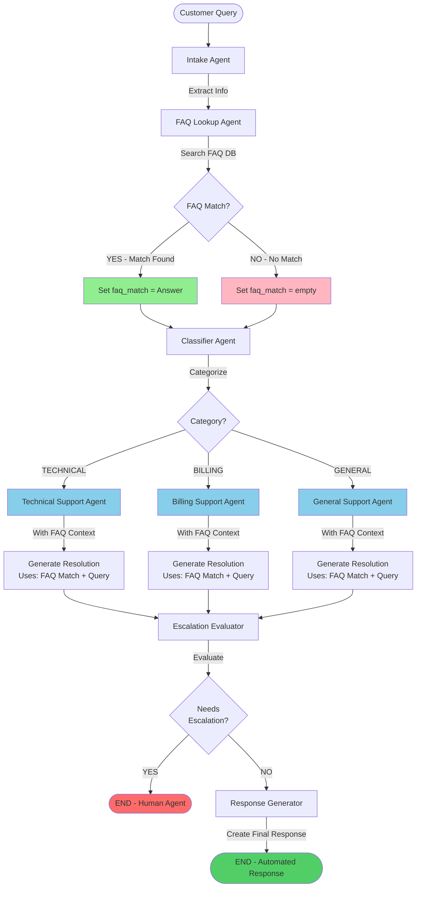
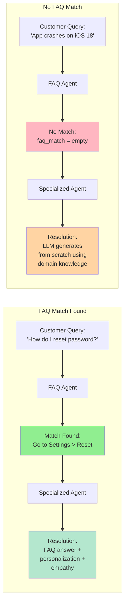
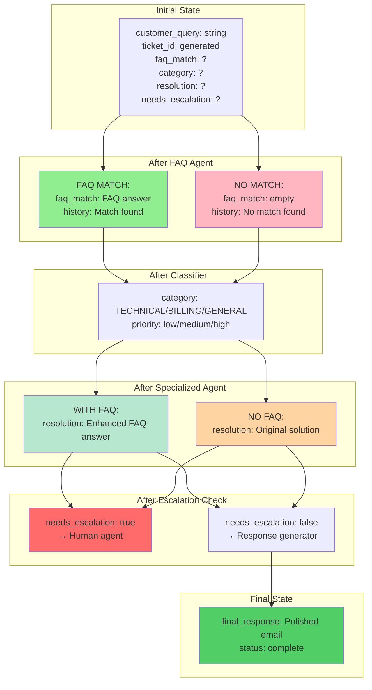
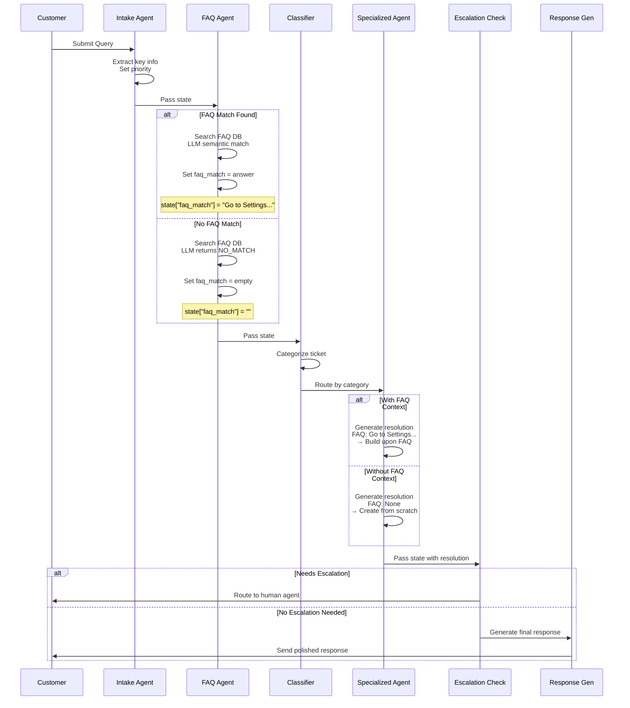

# Customer Support Ticket Workflow - Flow Diagram

> **Note:** Image versions (PNG/SVG) of all diagrams are available in the [`diagrams/`](./diagrams/) directory. These are ready to use in presentations, documentation, or anywhere you need visual representations.

## Complete Multi-Agent System Flow




## FAQ Match vs No Match - Detailed Comparison



## State Flow Through Agents



## Agent Processing Details



## Key Decision Points

| Decision Point | Location | Conditions | Outcomes |
|---------------|----------|-----------|----------|
| **FAQ Match** | FAQ Agent | LLM semantic match != "NO_MATCH" | ✅ Set faq_match<br/>❌ Set empty |
| **Category Route** | Classifier | Category classification | → Technical<br/>→ Billing<br/>→ General |
| **Escalation** | Escalation Check | Keywords + complexity + sentiment | ✅ Human agent<br/>❌ Auto response |

## State Changes Through Workflow

```
START
├── ticket_id: "TKT-001"
├── customer_query: "How do I reset my password?"
├── faq_match: ""
└── conversation_history: []

AFTER INTAKE
├── priority: "medium"
├── timestamp: "2025-10-25T10:30:00"
└── conversation_history: ["[INTAKE] Password reset query identified"]

AFTER FAQ (Match Found)
├── faq_match: "Go to Settings > Security > Reset Password"
└── conversation_history: ["[INTAKE]...", "[FAQ] Match found: Go to Settings..."]

AFTER FAQ (No Match)
├── faq_match: ""
└── conversation_history: ["[INTAKE]...", "[FAQ] No direct match found"]

AFTER CLASSIFIER
├── category: "TECHNICAL"
└── conversation_history: ["...", "[CLASSIFIER] Categorized as TECHNICAL"]

AFTER SPECIALIZED AGENT (With FAQ)
├── resolution: "Based on your query, here's how to reset...<FAQ content + details>"
└── conversation_history: ["...", "[TECHNICAL] Resolution provided"]

AFTER SPECIALIZED AGENT (No FAQ)
├── resolution: "Let me help you troubleshoot this issue... <generated solution>"
└── conversation_history: ["...", "[TECHNICAL] Resolution provided"]

AFTER ESCALATION CHECK
├── needs_escalation: false
└── conversation_history: ["...", "[ESCALATION] No escalation needed"]

AFTER RESPONSE GENERATOR
├── final_response: "Dear Customer,\n\nThank you for reaching out...\n\nTicket: TKT-001"
└── conversation_history: ["...", "[RESPONSE] Final response generated"]

END
```

## Viewing the Diagram

To view this diagram:
1. **GitHub/GitLab**: Automatically renders Mermaid diagrams
2. **VS Code**: Install "Markdown Preview Mermaid Support" extension
3. **Online**: Copy to https://mermaid.live
4. **Documentation sites**: Most modern docs platforms support Mermaid

## Architecture Highlights

✅ **No Short-Circuits**: FAQ match doesn't skip agents
✅ **Context-Aware**: FAQ informs but doesn't dictate
✅ **Consistent Flow**: Same path regardless of FAQ match
✅ **Safety Net**: Escalation evaluates all tickets
✅ **State Persistence**: All agent decisions tracked in conversation_history
